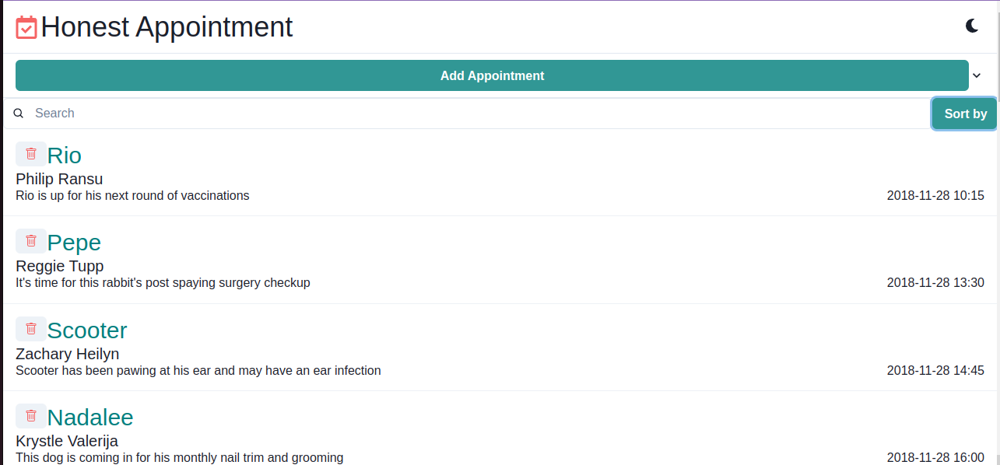
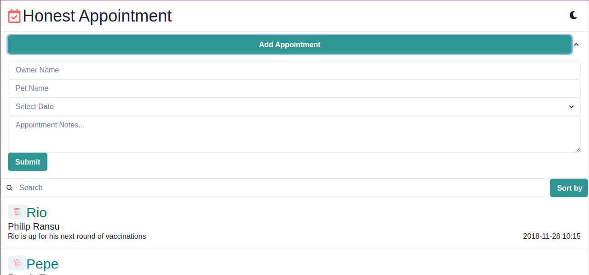
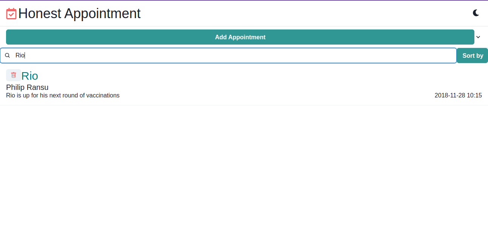

# Honest Appointment

## Introduction

Honest Appointment is a pet appointment Website that facilitates the management of pet appointments. This site lets you add new appointments, and search, and sort existing appointments.






## Tech Stack (Dependencies)

### 1. Frontend Dependencies

I have used **Javascript** and **React.js** with [Chakra UI](https://chakra-ui.com/) for the website's frontend.

```
node -v
npm -v
```

### 2. **Run the development server:**

```
npm install
npm start
```

### 3. **Verify on the Browser**<br>

Navigate to project homepage [http://127.0.0.1:3000/](http://127.0.0.1:3000/) or [http://localhost:3000](http://localhost:3000)
